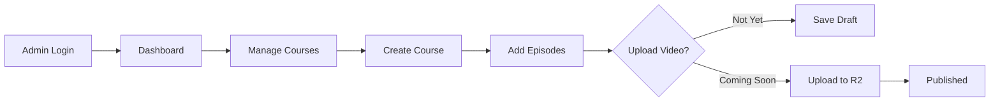

# 🎛️ Admin Panel Setup Guide

## 📊 Current Situation
- **Frontend:** Admin panel pages exist at `/admin/*`
- **Auth:** AdminLogin works at `/admin/login`
- **Database:** D1 is EMPTY (unlike old Railway DB with data)
- **Goal:** Complete admin workflow with course upload to R2

---

## 🚀 Quick Start Path

### Step 1: Create Your Admin User
You need at least ONE admin user to lock in. Run this SQL in your D1:

```sql
-- Create admin user (run in D1 console)
INSERT INTO admins (email, passwordHash, name, createdAt, updatedAt, lastSignedIn)
VALUES (
  'admin@xflexwithai.com',
  '$2a$10$YOUR_BCRYPT_HASH_HERE',
  'Admin',
  datetime('now'),
  datetime('now'),
  datetime('now')
);
```

**BUT** we need to hash the password first. I'll create a script for this.

### Step 2: Set Up Base Course Data
Insert sample courses and episodes into D1:

```sql
-- Sample course
INSERT INTO courses (title, description, price, isPublished, level)
VALUES (
  'Forex Trading Basics',
  'Learn the fundamentals of forex trading',
  29.99,
  1,
  'beginner'
);

-- Sample episodes for course
INSERT INTO episodes (courseId, title, description, videoUrl, duration, orderIndex)
VALUES (
  1,
  'Episode 1: Introduction',
  'Welcome to forex trading',
  'https://r2-bucket.com/videos/ep1.mp4',
  10,
  1
);
```

### Step 3: Access Admin Panel
1. Go to: https://xflexwithai.com/admin/login
2. Login with admin credentials
3. Access:
   - `/admin/courses` - Manage courses
   - `/admin/courses/:courseId/episodes` - Manage episodes
   - `/admin/users` - View users
   - `/admin/keys` - Manage registration keys

---

## 📋 Database Schema (Current)

### Tables in Your D1:
```
✅ admins - Platform administrators
✅ users - Student accounts
✅ courses - Course information
✅ episodes - Course episodes/lessons
✅ enrollments - User course registrations
✅ episodeProgress - User progress tracking
✅ registrationKeys - Key-based access
✅ lexaiSubscriptions - LexAI subscriptions
✅ lexaiMessages - Chat history
✅ quizzes - Quiz levels
✅ quizQuestions - Quiz questions
✅ quizOptions - Quiz answer options
✅ quizAttempts - User quiz attempts
✅ userQuizProgress - User quiz progress
✅ flexaiSubscriptions - FlexAI subscriptions
✅ flexaiMessages - FlexAI chat history
✅ authEmailOtps - One-time email login codes
```

---

## ✉️ Passwordless Email Login (OTP)

The app supports "email-first" sign-in using a **6‑digit one-time code**.

Important notes:
- This is **not** "email = login" (which is insecure). The user must prove inbox ownership.
- The mailbox password at https://privateemail.com is **not used** by the Worker.
- Cloudflare Workers generally cannot use raw SMTP reliably; use an **HTTP email provider**.

### Worker variables
These are already configured in [wrangler-worker.toml](wrangler-worker.toml):
- `EMAIL_FROM=support@xflexacademy.com`
- `EMAIL_FROM_NAME=XFlex Academy`
- `EMAIL_PROVIDER=auto` (tries Resend if configured, otherwise MailChannels)

### Option A (recommended): Resend (reliable delivery)
1. Create a Resend account and verify your sending domain `xflexacademy.com`.
2. Add the API key as a Wrangler secret:

```bash
wrangler secret put RESEND_API_KEY --env production
wrangler secret put RESEND_API_KEY --env staging
```

3. Deploy the Worker:

```bash
pnpm -w deploy:worker
```

### Option B: MailChannels (no API key)
If you do not set `RESEND_API_KEY`, the Worker will fall back to MailChannels.

To make MailChannels deliver reliably, you typically need to configure your domain DNS (SPF/DKIM) to authorize the sending service. If emails are not arriving, switch to Resend.

---

## 🔑 Step-by-Step Setup Process

### 1️⃣ Create Admin User

**Option A: Via SQL (Cloudflare D1)**
1. Go to Cloudflare Dashboard
2. Workers & Pages → D1
3. Run this query:

```sql
-- First, create an admin (we'll provide a pre-hashed password)
INSERT INTO admins (email, passwordHash, name)
VALUES ('admin@xflexwithai.com', '...', 'Admin');
```

**Option B: Via TypeScript Script (Create script)**
```typescript
// scripts/create-admin.ts
import { hashPassword } from "../backend/_core/auth";
import { createAdmin } from "../backend/db";

async function main() {
  const password = process.argv[2] || "DefaultPassword123!";
  const hash = await hashPassword(password);
  
  const adminId = await createAdmin({
    email: "admin@xflexwithai.com",
    passwordHash: hash,
    name: "Admin",
  });
  
  console.log(`✅ Admin created with ID: ${adminId}`);
  console.log(`Email: admin@xflexwithai.com`);
  console.log(`Password: ${password}`);
}

main().catch(console.error);
```

### 2️⃣ Seed Sample Data

**Create seed script:**
```typescript
// scripts/seed-courses.ts
import { db, createCourse, createEpisode } from "../backend/db";

async function seed() {
  // Create sample course
  const courseId = await createCourse({
    title: "Forex Trading Fundamentals",
    description: "Learn forex trading from scratch",
    price: 29.99,
    currency: "USD",
    level: "beginner",
    isPublished: true,
  });
  
  console.log(`✅ Course created: ${courseId}`);
  
  // Create sample episodes
  for (let i = 1; i <= 5; i++) {
    await createEpisode({
      courseId,
      title: `Episode ${i}: ${i === 1 ? 'Introduction' : 'Advanced Topics'}`,
      description: `Learn lesson ${i}`,
      videoUrl: 'https://example.com/video.mp4', // Will upload real videos later
      duration: 10 + (i * 5),
      orderIndex: i,
    });
  }
  
  console.log(`✅ 5 episodes created`);
}

seed().catch(console.error);
```

---

## 🎥 Admin Panel Features Overview

### `/admin/login` - Admin Login
- Email: admin@xflexwithai.com
- Password: (set during creation)

### `/admin/dashboard` - Main Dashboard
Shows:
- Total users
- Total courses
- Total enrollments
- Revenue stats
- Recent activity

### `/admin/courses` - Course Management
**Features:**
- ✅ List all courses
- ✅ Create new course
- ✅ Edit course info
- ❌ Upload video (Need to implement)
- ❌ Set price/access (Need to implement)

### `/admin/courses/:courseId/episodes` - Episode Management
**Features:**
- ✅ List episodes
- ✅ Create new episode
- ✅ Edit episode order
- ❌ Upload episode video (Need to implement)
- ❌ Set duration (Need to implement)

### `/admin/users` - User Management
**Features:**
- ✅ View all users
- ✅ See enrollment status
- ✅ Track user progress
- ❌ Suspend users (Need to implement)

### `/admin/keys` - Registration Keys
**Features:**
- ✅ Generate keys
- ✅ View key status
- ✅ Track redemptions

---

## 🎬 What We Need to Add for Complete functionality

### 1. **Video Upload to R2**
- Create endpoint: `POST /api/upload/video`
- Accept file upload
- Store in R2 bucket: `xflexwithai-videos`
- Return video URL
- Update episode with video URL

### 2. **Course Publishing Controls**
- Toggle publish/unpublish
- Set price
- Set availability
- Add thumbnail image

### 3. **Episode Ordering**
- Drag-to-reorder episodes
- Auto-save order
- Update database

---

## 📝 Admin Flow (What You Can Do Now)



---

## 🔐 Admin Credentials Setup

You need to:
1. ✅ Know the admin email
2. ✅ Set a strong password
3. ✅ Generate bcrypt hash
4. ✅ Insert into database

---

## Next Actions

**Immediate (Today):**
1. Create admin user via D1 SQL
2. Seed 1-2 courses with episodes
3. Test login at `/admin/login`
4. Access `/admin/dashboard`

**Follow-up (This Sprint):**
1. Build video upload endpoint
2. Connect admin UI to upload
3. Test R2 storage
4. Enable course publishing

**Later (Phase 2):**
1. User enrollment from home page
2. Payment integration
3. Email notifications
4. Analytics

---

## 🚨 Important Notes

⚠️ **Database is EMPTY** - You need to:
- Create admin user manually (one-time)
- Seed initial courses (can be done via admin panel later)
- Upload videos (via R2)

⚠️ **Video Upload** - Not yet implemented:
- Admin can create episodes with dummy URL
- Need to build upload handler
- Need to connect to R2

✅ **Already Working:**
- Admin authentication
- Course CRUD operations
- User management views
- Database connections
- R2 bucket connected

---

## Command Reference

```bash
# Create admin script (when ready)
npx tsx scripts/create-admin.ts YourSecurePassword123

# Seed sample data (when ready)
npx tsx scripts/seed-courses.ts

# Build and deploy
npm run build
wrangler pages deploy dist/public --project-name xflexwithai
```

---

Ready to proceed? Let me know which step to tackle first! 🚀
