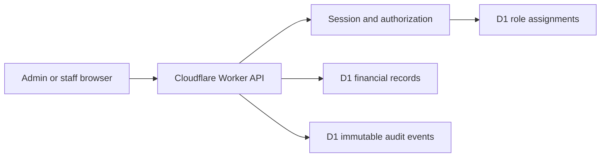

# Financial Authorization Phase 1 Threat Model

## Executive summary

Phase 1 protects the integrity and confidentiality of XFlex Academy's financial records by separating generic administration from explicit finance authority. The highest risks are finance-role self-escalation, relying on a hard-coded admin identifier, unaudited revocation when staff access is removed, and coupling payment confirmation to broader key-management powers.

## Scope and assumptions

In scope: `backend/routers.ts`, `backend/db.ts`, `backend/_core/context.ts`, `database/schema-sqlite.ts`, the Phase 1 migration, role-management UI contracts, and focused authorization tests. Cloudflare Worker, D1, and the existing session cookie are production runtime components. Expense approval, receipt R2 storage, historical backfill, statutory accounting, CI, and deployment are out of scope for this phase.

Confirmed assumption: only the explicitly assigned business owner is `finance_owner`; current or future generic admins are not finance owners automatically. Production currently has one intended owner admin and no assigned staff finance roles. `finance_manager` may confirm payments, while `finance_clerk` and `finance_viewer` may not.

Open question for a later phase: the controlled process for transferring ownership while guaranteeing that at least one active owner remains.

## System model

### Primary components

- React admin UI calls tRPC routes through the public Cloudflare edge.
- `backend/_core/context.ts` validates the session and maps admin and user identities from separate tables.
- `backend/routers.ts` performs route-level and operation-level authorization.
- `backend/db.ts` reads role assignments and writes role changes plus immutable audit events to D1.

### Data flows and trust boundaries

- Admin or staff browser → Worker API: session cookie, order IDs, finance-role changes, and payment-confirmation fields cross HTTPS; authentication is handled in `createContext`, and tRPC inputs use Zod.
- Worker API → authorization data in D1: admin identity, explicit owner assignment, and staff `userRoles` are resolved with indexed lookups before finance operations.
- Worker API → financial records in D1: confirmed-payment and audit writes use bounded transactions and uniqueness constraints.
- Finance owner → staff role management: finance-role mutations require explicit owner authority; generic admin status alone is insufficient.

#### Diagram

## Assets and security objectives

| Asset | Why it matters | Security objective (C/I/A) |
|---|---|---|
| Owner and staff finance assignments | Determine who can see or change private finances | C/I/A |
| Payment confirmations and ledger entries | Drive management income and cannot be silently duplicated | I/A |
| Finance-role audit events | Prove who granted or revoked authority | I/A |
| Order and payment evidence linkage | Supports approval decisions without exposing unnecessary PII | C/I |
| Session credentials | Compromise permits actions as an owner or staff user | C/I |

## Attacker model

### Capabilities

- An unauthenticated internet user can reach public Worker endpoints.
- An authenticated employee may possess a non-finance role such as `key_manager`.
- A generic admin account may be legitimate but intentionally lack finance authority.
- A compromised authorized session can submit valid-looking tRPC requests directly without using the UI.

### Non-capabilities

- The modeled remote attacker cannot edit deployed Worker code, run Wrangler, or write D1 outside application routes.
- Cloudflare account takeover and malicious source-control maintainers are outside this phase.
- Receipt upload/parser threats are deferred until the R2 expense-evidence phase.

## Entry points and attack surfaces

| Surface | How reached | Trust boundary | Notes | Evidence |
|---|---|---|---|---|
| Order status mutation | Authenticated tRPC mutation | Browser → Worker | `completed` also confirms cash and issues an operational key | `backend/routers.ts` / `orders.adminUpdateStatus` |
| Finance-role assignment/removal | Admin tRPC mutations | Admin → Worker → D1 | Must require owner, not only generic admin | `backend/routers.ts` / `roles.assign`, `roles.remove`, `roles.setRoles` |
| Staff removal | Admin tRPC mutation | Admin → Worker → D1 | Existing bulk role deletion can bypass finance audit | `backend/db.ts` / `removeStaffStatus` |
| Owner lookup | Authorization helper | Worker → D1 | Must use explicit indexed assignment, not numeric identity convention | `backend/routers.ts` / current bootstrap check |
| Session identity mapping | Cookie-authenticated request | Internet → Worker | Admin and user tables have separate numeric namespaces | `backend/_core/context.ts` / `createContext` |

## Top abuse paths

1. Generic admin calls a finance-role mutation → grants a controlled staff account `finance_manager` → confirms payments or reads future financial reports.
2. A future admin receives database ID 1 in another environment → hard-coded owner check succeeds → unauthorized payment confirmation.
3. Admin removes staff status → finance roles are deleted directly → immutable finance audit omits the revocation.
4. Finance manager is forced to receive `key_manager` → gains unrelated operational key powers → changes or issues keys outside finance duties.
5. Clerk or key manager calls the order mutation directly → attempts to bypass UI restrictions → records payment without finance authority.
6. Concurrent confirmation requests → attempt duplicate income → uniqueness and confirmation lookup must return one event.

## Threat model table

| Threat ID | Threat source | Prerequisites | Threat action | Impact | Impacted assets | Existing controls (evidence) | Gaps | Recommended mitigations | Detection ideas | Likelihood | Impact severity | Priority |
|---|---|---|---|---|---|---|---|---|---|---|---|---|
| TM-001 | Generic admin | Valid non-owner admin session | Grants or removes finance staff roles | Unauthorized financial access or denial | Role assignments, finance data | Finance-role audit writes exist in `backend/db.ts` | Finance mutations currently begin with `adminProcedure` | Require explicit owner lookup before every finance-role delta and creation path | Alert on denied and successful finance-role changes | Medium | High | High |
| TM-002 | Misconfiguration or future admin | Hard-coded owner ID matches wrong principal | Confirms payment as owner | False revenue and key issuance | Ledger, confirmations, orders | Confirmation checks actor and unique order in `backend/routers.ts` and `backend/db.ts` | Owner is currently `admin id 1` in code | Add explicit owner-assignment table and indexed lookup; bootstrap only the approved current owner | Log owner authorization failures and assignment changes | Medium | High | High |
| TM-003 | Staff finance manager | Finance manager needs order approval | Receives `key_manager` merely to reach the route | Excess operational privilege | Keys, entitlements, orders | Operation-level finance check exists | Route middleware only admits admins or key managers | Admit finance manager to list/confirm, then separately guard non-financial order operations | Audit order mutations by role/capability | Medium | Medium | Medium |
| TM-004 | Generic admin or bug | Staff removal path is invoked | Deletes finance roles without finance audit | Loss of accountability | Role audit | Dedicated audit table has no-update/no-delete triggers in migration 106 | `removeStaffStatus` directly deletes all `userRoles` | Require owner for staff removal when finance roles exist and batch revocation audits with removal | Reconcile active assignments against audit events | Medium | High | High |
| TM-005 | Authorized preparer | Future expense or adjustment workflow exists | Approves own submission | Fraudulent expense or adjustment | Ledger, expenses | Actor fields exist in financial schema | Workflow is not implemented yet | Enforce different submitter/approver IDs in transaction boundary | Alert on rejected self-approval | Medium | High | High |
| TM-006 | Retrying client | Valid owner or manager session | Repeats payment confirmation | Duplicate income | Confirmations, ledger | Unique confirmation/order and unique ledger source indexes; `confirmOrderPayment` is idempotent | Needs regression coverage through explicit owner lookup | Preserve database uniqueness and atomic batch | Monitor uniqueness conflicts and idempotent retries | Low | High | Medium |

## Criticality calibration

- Critical: remote auth bypass into owner authority; arbitrary modification of approved ledger records.
- High: generic-admin finance escalation; wrong-owner mapping; unaudited finance revocation; self-approved financial entries.
- Medium: excessive operational key permissions; bounded information exposure without write authority; denial of a single approval flow.
- Low: harmless UI-only role-label mismatch; rejected unauthorized request with complete audit evidence.

## Focus paths for security review

| Path | Why it matters | Related Threat IDs |
|---|---|---|
| `backend/routers.ts` | Central finance capability enforcement and order mutation boundary | TM-001, TM-002, TM-003, TM-006 |
| `backend/db.ts` | Owner lookup, atomic role changes, audit writes, and payment idempotency | TM-002, TM-004, TM-006 |
| `backend/_core/context.ts` | Separates admin and staff principals derived from sessions | TM-002 |
| `database/schema-sqlite.ts` | Canonical role, audit, and uniqueness model | TM-002, TM-004, TM-006 |
| `database/migrations/106_financial_management_foundation.sql` | Existing append-only staff finance audit controls | TM-004 |
| `frontend/src/pages/AdminRoles.tsx` | UI must not imply that generic admins can grant finance authority | TM-001 |
| `frontend/src/pages/AdminOrders.tsx` | Payment-confirmation UI must align with server capability checks | TM-003, TM-006 |
| `server/financialAuthorization.test.ts` | Required negative and separation-of-duty coverage | TM-001, TM-002, TM-003, TM-004 |

## Notes on use

- Covered the discovered Phase 1 entry points and the browser, authentication, authorization, and D1 trust boundaries.
- Runtime behavior is separated from deployment and developer tooling.
- The owner's clarification that only an explicitly assigned business owner receives `finance_owner` is reflected throughout.
- Ownership transfer and last-owner protection remain a later explicitly designed workflow; Phase 1 must not expose generic owner grant/revoke operations.
